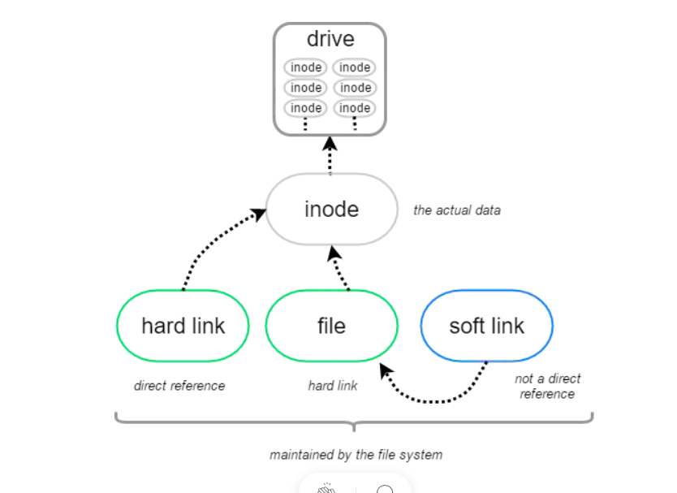

# Linux File Link

# Linking File

- Symbolic Link
- Hard Link

## Symbolic Link (soft link)

- a physical file that point to another file in the directory sturcture

- do not share same contents
- can be make soft link in different physical device

`ln -s data softlink_data`

## Hard link 

- seperate file that contains information about the original file 

- physically same file

- can be used on same physical device

`ln data hardlink_data`

## Application using soft link 

- Create soft Link to `PATH` variable make your script can run anywhere in your system

- Bypass blocked permission