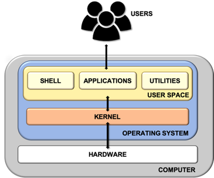

<h1 align="center">Linux Shell</h1>

# Shell Architecture

#### General Architecture

- Kernal	: Deal with hardware
- Utilities : Small, come with OS
- Shell		: Textual Command-Line Interface

# Linux Shell

#### Fucntion
- Manage files and process
- Execute the programs
- Command-lin Utilities/shell command
- Scripting
	- script : a set of shell command that consititue an executable program

# Difference type of Linux Shell

## The Bourne Shell (sh)

- Develop at AT&T lab by Steve Bourne
- Cannot recall privously used command
- lack of comprehensive feature
- Complete path name
	- `/bin/sh`  
	- `/sbin/sh`

## The GNU Bourne-Again Shell (bash)

- Design to compatible with the Bourne Shell
- incorporate useful feature from different type of shells
- Allow automatically recall previous command and edit them with the help of arrow keys
- Complete path name
	- `/bin/bash/` 
	
## The `C Shell` (csh)
- Develop by University of California by Bill Joy
- Provide useful programming features and syntax similar to `C programming Language`
- Prominent feature of C shell is `aliases`
- Complete path name
	- `/bin/csh`

## The ` Z shell` (zsh)

- Provide shell extension with a lot of improvement for customization
- Morden look and feature
- Complete path
	- `/bin/zsh`

## Firendly Interactive Shell (fish)

- Focus on usability
- Feature-rich shell does not required additional configuration
- User-Friendly
- Complete path
	- `/usr/bin/fish`

