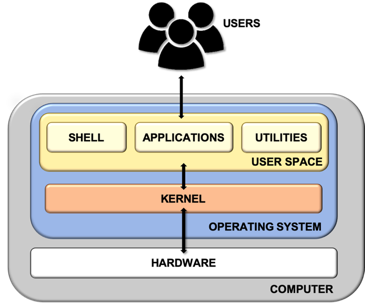

<h1 align="center">Linux Shell</h1>

# Shell Architecture



#### General Architecture

- Kernal	: Deal with hardware
- Utilities : Small, come with OS
- Shell		: Textual Command-Line Interface

# Linux Shell

#### Fucntion
- Manage files and process
- Execute the programs
- Command-lin Utilities/shell command
- Scripting
	- script : a set of shell command that consititue an executable program


# Difference type of Linux Shell

## The Bourne Shell (sh)

- Develop at AT&T lab by Steve Bourne
- Cannot recall privously used command
- lack of comprehensive feature
- Complete path name
	- `/bin/sh`  
	- `/sbin/sh`

## The GNU Bourne-Again Shell (bash)

- Design to compatible with the Bourne Shell
- incorporate useful feature from different type of shells
- Allow automatically recall previous command and edit them with the help of arrow keys
- Complete path name
	- `/bin/bash/` 
	
## The `C Shell` (csh)
- Develop by University of California by Bill Joy
- Provide useful programming features and syntax similar to `C programming Language`
- Prominent feature of C shell is `aliases`
- Complete path name
	- `/bin/csh`

## The ` Z shell` (zsh)

- Provide shell extension with a lot of improvement for customization
- Morden look and feature
- Complete path
	- `/bin/zsh`

## Firendly Interactive Shell (fish)

- Focus on usability
- Feature-rich shell does not required additional configuration
- User-Friendly
- Complete path
	- `/usr/bin/fish`


# Shell Script

- The Basic Concept of a shell script is a list of command which are listed in the order of execurtion

- Good shell script will have comments, preceded by hash (pound) mark `#` decribing the steps

- Shell scripts and function are interpreted and not compiled.

- execute line-by-line, test-by-test from top to bottom


# Running a shell script

1. `bash script.sh`

2. `./script.sh`

3. `sh script.sh` 


# Declare the shell

- `#!` - shebang or hashbang
- it is used in the very first line of the script. It is used to specify the interpreter with which the given script will be run by default.

- eg 
	- `#!/bin/bash`
	- `#!/bin/zsh`
	- `#!/usr/bin/python`


- not mandatory


# Importance of specifying shebang

- sample shell script with an array of distributions. The script then displays the distro at index 2.

```
distros=("Ubuntu" "Fedora" "SUSE" "Debian")
echo "Distro at index 2 is: ${distros[2]}"

```

#### Output

- with BASH ==> SUSE
- with ZSH	==> Fedora	


** It shows SUSE at index 2 because array index start at 0 in Bash and many other programming and scripting languages. BUT that's not the case in Z shell. In Z shell, array index starts at 1. ** 

