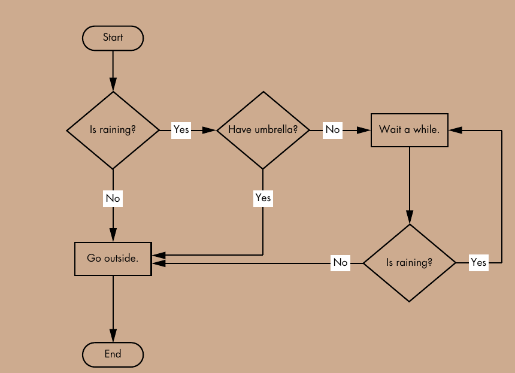

# Conditional Branching

- Condition evaluate Boolean value, `True`, `False`




- Diamond 						==> `branching poing`
- starting and ending point  	==> `round`
- Other step 					==> `rectangle`


# Linux Exit Status Codes

- By default, your shell script exits with the exit status of the last command in your script
- exit status code can only go upto `255`


|code 		| Description						|
|-----------|-----------------------------------|
| `0`		| Successful completion of Commands	|
| `1`		| General unknow error				|
| `2` 		| Misues of shell Commands			|
| `126`		| The command can't execute			|
| `127`		| Command not found					|
| `128`		| Invalid exit argument				|
| `130`		| Command terminated with Ctrl+C 	|


#### `126` exit code exmaple

- Remove `execute` permission of `bash script`
- run `bash script`
- run `echo $?`
- it return exit code `126`

#### `127` exit code example

- run the command that not exit
- run `echo $?`
- it return exit code `127`

## Giving your own exit status code

``` bash
#!/bin/bash
# testing the exit status
var1=10
var2=30
var3=$[$var1 + $var2]
echo The answer is $var3
exit 55
```

- This code return `exit status code` `55`


# Tesing an expression using `test` and `[]`


## comparisons operator


| Numeric  	| String 		|		 Description	|
|----------	|---------------|-----------------------|
| `eq`		| `=`, `==`		| equal					|
| `gt`		| `>`			| greater than			|
| `lt`		| `<`			| less than				|
| `ge`		| `>=`			| greater than or equal	|
| `le`		| `<=`			| than or equal			|
| `ne`		| `!=`			| not equal				|
|			| `-n` string	| check if `string` has length greater than zero|
|		 	| `-z` string 	| check if `string` had length of zero			|


## String comparison operator


# Testing condtion with `test` command or `[]`

#### Using `test`
`test 1 -eq 1`

`echo $?`

#### Using `[]`
`[ 1 -eq 1`]

`echo $?`


## You can use `Double Square Bracket`, `[[]]` for comparism

- Double bracket extend the `test` command
- Using double bracket help to avoid logic error in Bash `&&` , `||` , `>`, `<`

#### In comparison operator

- Single Bracket produce error


`[ 1 < 2 ] && echo “1 is less than 2”`  

- Double Bracket produce no error

`[[ 1 < 2 ]] && echo “1 is less than 2”`


## In Grouping Expression

- Single Bracket produce error 

`[ 3 -eq 3 -a (2 -eq 2 -a 1 -eq 1) ] && echo “Parentheses can be used”`

- Double Bracket produce no error

`[[ 3 -eq 3 && (2 -eq 2 && 1 -eq 1) ]] && echo “Parentheses can be used”`


## In Pattern Matching

- It is not possible to use `pattern matching` in single bracket


- `Pattern Matching` is possible in `Double Bracket`

```
name=”Alice”
[[ $name = *c* ]] && echo “Name includes c”
echo $?
```


