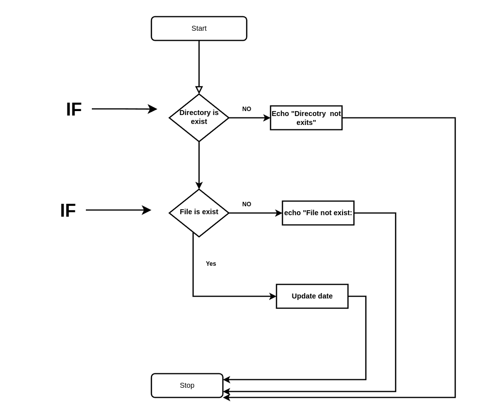

# Conditional Branching


# `if` statement 


``` bash
if [[ condition ]]
then
	<command>
fi
```


``` bash
#!/bin/bash

echo -e "Enter Your Name"
read name

if [[ $name == "Bob" ]]
then
	echo -e "\nHi Bob"
fi

```


# if_else Statement

``` bash
if [[ condition ]]
then
	<commands>
else
	<other commands>
fi
```


``` bash
#!/bin/bash

echo "Enter Your Name"
read name

if [[ $name == "Bob" ]]
then
	echo "Hi Bob"
else
	echo "Hi stranger"
fi

```

# if_elif_else Statement

``` bash
if [[ condition ]]
then
	<commands>
elif [[ <some test> ]]
then
	<different commands>
else
	<other commands>
fi
```


``` bash

#!/bin/bash

echo "Enter Your Name"
read name

if [[ $name == "Bob" ]] 
then
	echo "Hi Bob"
elif [[ $name == "Alice" ]]
then
	echo "Hi Alice"
else
	echo "Your are not Bob or Alice!"
fi

```


## Operator for checking file characteristics

<table class="table table-bordered">
<tr>
<th style="text-align:center;">Operator</th>
<th style="text-align:center;">Description</th>

</tr>
<tr>
<td class="ts"><b>-b file</b></td>
<td>Checks if file is a block special file; if yes, then the condition becomes true.</td>

</tr>
<tr>
<td class="ts"><b>-c file</b></td>
<td>Checks if file is a character special file; if yes, then the condition becomes true.</td>

</tr>
<tr>
<td class="ts"><b>-d file</b></td>
<td>Checks if file is a directory; if yes, then the condition becomes true.</td>

</tr>
<tr>
<td class="ts"><b>-f file</b></td>
<td>Checks if file is an ordinary file as opposed to a directory or special file; if yes, then the condition becomes true.</td>

</tr>
<tr>
<td class="ts"><b>-g file</b></td>
<td>Checks if file has its set group ID (SGID) bit set; if yes, then the condition becomes true.</td>

</tr>
<tr>
<td class="ts"><b>-k file</b></td>
<td>Checks if file has its sticky bit set; if yes, then the condition becomes true.</td>

</tr>
<tr>
<td class="ts"><b>-p file</b></td>
<td>Checks if file is a named pipe; if yes, then the condition becomes true.</td>

</tr>
<tr>
<td class="ts"><b>-t file</b></td>
<td>Checks if file descriptor is open and associated with a terminal; if yes, then the condition becomes true.</td>

</tr>
<tr>
<td class="ts"><b>-u file</b></td>
<td>Checks if file has its Set User ID (SUID) bit set; if yes, then the condition becomes true.</td>

</tr>
<tr>
<td class="ts"><b>-r file</b></td>
<td>Checks if file is readable; if yes, then the condition becomes true.</td>

</tr>
<tr>
<td class="ts"><b>-w file</b></td>
<td>Checks if file is writable; if yes, then the condition becomes true.</td>

</tr>
<tr>
<td class="ts"><b>-x file</b></td>
<td>Checks if file is executable; if yes, then the condition becomes true.</td>

</tr>
<tr>
<td class="ts"><b>-s file</b></td>
<td>Checks if file has size greater than 0; if yes, then condition becomes true.</td>

</tr>
<tr>
<td class="ts"><b>-e file</b></td>
<td>Checks if file exists; is true even if file is a directory but exists.</td>

</tr>
</table>


- These conditions give the ability to check file system within shell scripts.

## Checking directories

``` bash
#!/bin/bash

directory=/home/$USER

if [[ -d $directory ]]
then
	echo  -e "The $directory directory exits\n"
	cd $directory
	ls -alsh 
else
	echo -e "The $directory does not exits\n"

fi
```

## Checking Whether Object exit (Nested `if`)





``` bash
#!/bin/bash

# Check if either a directory of file exists

location=$HOME
file_name="test.txt"


if [[ -e $location ]] 
then
	echo "[+] OK on the $location directory"
	echo "[+] Now checking on the file, $file_name"
	
	if [[ -e $location/$file_name ]] 
	then 
		echo -e "[+] OK on the filename\n"
		echo -e "[+] File with old date"
		ls -alsh $location/$file_name
		echo -e "\n[+] Updating current Date\n"
		date >> $location/$file_name
		echo -e "[+] File wit new date\n"
		ls -alsh $location/$file_name

	else
		echo -e "File does not exist"
		echo -e "Nothing to update"
	fi
else
	echo "The $location directory does not exit"
	echo "Nothing to update"
fi
```


# Case Statement

``` bash
case $variable in
match-1)
		
		commands
		;;
match-2)
		commands
		;;

*) 
		commands
		;;

esac
```


## `if` and `case`

``` bash
#!/bin/bash
# Script		: caseTest.sh
# Author		: Dr. 404
# Purpose		: For testing case command
# Version		: 1.0
# Created Date	: Wed Mar 15 02:05:07 PM +0630 2023
# Modified Date	: 


# Recording user input into $num variable

read -p "Enter Your number : " num


# if Statement

if [[ $num -eq 1 ]]
then
	echo "Hello"
	echo "This is 1"

elif [[ $num -eq 2 ]]

then
	echo "Hello"
	echo "This is 2"

elif [[ $num -eq 3 ]]
then
	echo "Hello"
	echo "This is 3"
else
	echo "Not Valid"
fi


: '
# Case Statement


case $num in 
1) 	echo "Hello"
	echo "This is 1 wiht case" ;;
2)	echo "Hello"
	echo "This is 2 with case" ;;
3) 	echo "Hello"
	echo "This is 3 with case" ;;
*) 	echo "Not Valid with case"
esac'
```


# Testing for More Than One Thing 


## Conditional Operator 

And = `&&` == `a`

OR  = `||` == `o`

- `a` and OR ==> `-o` can be use inside the bracket