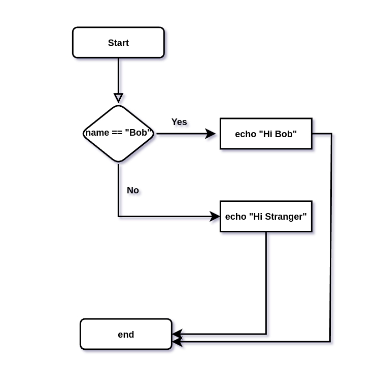

# Conditional Branching


# `if` statement 


``` bash
if [[ condition ]]
then
	<command>
fi
```


``` bash
#!/bin/bash

echo -e "Enter Your Name"
read name

if [[ $name == "Bob" ]]
then
	echo -e "\nHi Bob"
fi

```


# if_else Statement

``` bash
if [[ condition ]]
then
	<commands>
else
	<other commands>
fi
```



``` bash
#!/bin/bash

echo "Enter Your Name"
read name

if [[ $name == "Bob" ]]
then
	echo "Hi Bob"
else
	echo "Hi stranger"
fi

```

# if_elif_else Statement

``` bash
if [[ condition ]]
then
	<commands>
elif [[ <some test> ]]
then
	<different commands>
else
	<other commands>
fi
```


``` bash

#!/bin/bash

echo "Enter Your Name"
read name

if [[ $name == "Bob" ]] 
then
	echo "Hi Bob"
elif [[ $name == "Alice" ]]
then
	echo "Hi Alice"
else
	echo "Your are not Bob or Alice!"
fi

```


# Testing for More Than One Thing 


## Operator for checking file characteristics

<table class="table table-bordered">
<tr>
<th style="text-align:center;">Operator</th>
<th style="text-align:center;">Description</th>
<th style="text-align:center;width:29%">Example</th>
</tr>
<tr>
<td class="ts"><b>-b file</b></td>
<td>Checks if file is a block special file; if yes, then the condition becomes true.</td>

</tr>
<tr>
<td class="ts"><b>-c file</b></td>
<td>Checks if file is a character special file; if yes, then the condition becomes true.</td>

</tr>
<tr>
<td class="ts"><b>-d file</b></td>
<td>Checks if file is a directory; if yes, then the condition becomes true.</td>

</tr>
<tr>
<td class="ts"><b>-f file</b></td>
<td>Checks if file is an ordinary file as opposed to a directory or special file; if yes, then the condition becomes true.</td>

</tr>
<tr>
<td class="ts"><b>-g file</b></td>
<td>Checks if file has its set group ID (SGID) bit set; if yes, then the condition becomes true.</td>

</tr>
<tr>
<td class="ts"><b>-k file</b></td>
<td>Checks if file has its sticky bit set; if yes, then the condition becomes true.</td>

</tr>
<tr>
<td class="ts"><b>-p file</b></td>
<td>Checks if file is a named pipe; if yes, then the condition becomes true.</td>

</tr>
<tr>
<td class="ts"><b>-t file</b></td>
<td>Checks if file descriptor is open and associated with a terminal; if yes, then the condition becomes true.</td>

</tr>
<tr>
<td class="ts"><b>-u file</b></td>
<td>Checks if file has its Set User ID (SUID) bit set; if yes, then the condition becomes true.</td>

</tr>
<tr>
<td class="ts"><b>-r file</b></td>
<td>Checks if file is readable; if yes, then the condition becomes true.</td>

</tr>
<tr>
<td class="ts"><b>-w file</b></td>
<td>Checks if file is writable; if yes, then the condition becomes true.</td>

</tr>
<tr>
<td class="ts"><b>-x file</b></td>
<td>Checks if file is executable; if yes, then the condition becomes true.</td>

</tr>
<tr>
<td class="ts"><b>-s file</b></td>
<td>Checks if file has size greater than 0; if yes, then condition becomes true.</td>

</tr>
<tr>
<td class="ts"><b>-e file</b></td>
<td>Checks if file exists; is true even if file is a directory but exists.</td>

</tr>
</table>


## Conditional Operator 

And = `&&` == `a`

OR  = `||` == `o`

- `a` and OR ==> `-o` can be use inside the bracket

