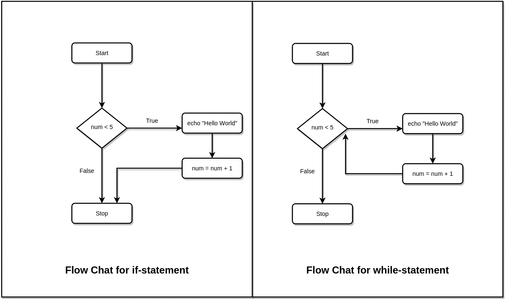

# Bash Looping

# `while` Loop

```bash

while [ condition ]
do
	commands

done
```




``` bash
#!/bin/bash
# Script		: while_loop.sh
# Author		: Dr. 404
# Purpose		: Explaining while loop using algorithm
# Version		: 
# Created Date	: Wed Mar 15 02:56:37 PM +0630 2023
# Modified Date	: 


# Store user input into $num variable

read -p "Enter Your Number: " num

# If statement
: '
if [[ $num -lt 5 ]]
then
	echo "Hello World from it statement"
	num=$[ $num + 1 ]
	echo $num

fi
'


# While Statement

while [[ $num -lt 5 ]]
do
	echo "Hello World from while Statement"
	num=$[ $num + 1 ]
	echo $num
done

```

# `until` loop

```bash
until [ condition is FALSE ]
do
	commands
done
```

## Example `until` loop

```bash
#!/bin/bash
# Script		: until.sh
# Author		: Dr. 404
# Purpose		: until loop explain
# Version		: 
# Created Date	: Wed Mar 15 03:33:18 PM +0630 2023
# Modified Date	: 


# Until Loop work while condition is FALSE
read -p "Enter Your Number : " num
until [[ $num -gt 5 ]]
do
	echo "Hello World from while Statement"
	num=$[ $num + 1 ]
	echo $num
done
```


# for Loop

## Pattern 1

```bash

for (( variable assignment; condition; iteration process))

do
	commands
done
```

## Pattern 2

```bash

for $variable in {start..stop..step} # Step is optional
do
	commands
done
```

## Example for loop (Pattern-1)

1. 
```bash
#!/bin/bash
# Script		: for_loop.sh
# Author		: Dr. 404
# Purpose		: To explain for loop
# Version		: 
# Created Date	: Wed Mar 15 04:03:58 PM +0630 2023
# Modified Date	: 


read -p "Enter Your Number " num
for (( i=$num; i <5; i++ ))
do
	echo "Hello World"
	echo $i
done
```


## Example for Loop (Pattern-2)

```bash
#!/bin/bash
# Script		: for_loop_2.sh
# Author		: Dr. 404
# Purpose		: To Explain for loop pattern-2
# Version		: 
# Created Date	: Wed Mar 15 04:32:59 PM +0630 2023
# Modified Date	: 

for i in {1..10..2};
do
	echo $i
do
```


# Nesting Loop

- A loop within loop

```bash
#!/bin/bash
# Script		: nested_loop.sh
# Author		: Dr. 404
# Purpose		: To Explain Nested loop
# Version		: 1.0
# Created Date	: Wed Mar 15 04:11:32 PM +0630 2023
# Modified Date	: 


for (( a =1 ; a <= 3 ; a++ ))
do 
	echo "Starting Outside Loop $a : "
	
	for (( b = 1; b <= 3 ; b++ ))
	do
		echo "	Inside Loop: $b"
		
	done


done
```


