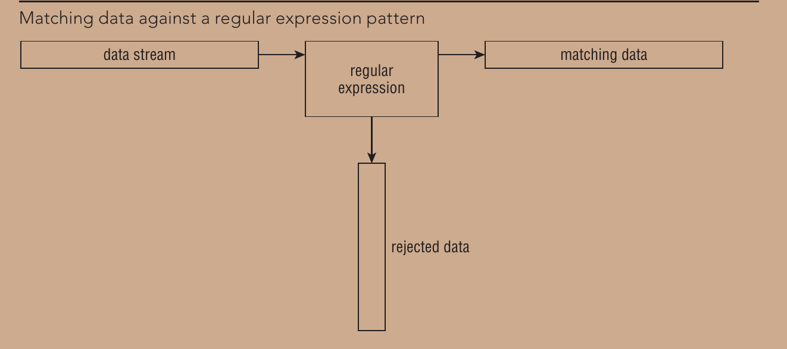

# Regular Expresssion



- The biggest problem with using regular expressions is that there isn’t just one set of them.
- Several different applications use different types of regular expressions in the Linux environment


# Element of Regular Epression

## Literal character 
- regular exrpession match themselves literally
- `hello` match "hello" in the input

## Metacharacter 
- character have special meaning
1. `.` (dot) - Matches nay single character except new line
2. `*` (asterisk) - Matches zero or more occurence of the previous character or group
3. `+` (Plus) - Matches one or more occurences of previous character or group
4. `?` (question mark) - Matches zero or one occurrence of the previous character or group
5. `|` (pipe): Acts as an OR operator, allowing multiple 
alternatives. For example, a|b matches either "a" or "b".
6. `[ ]` (square brackets): Defines a character class, matching any single character within the brackets. For example, `[abc]` matches "a", "b", or "c"
7. `[^ ]` (caret inside square brackets): Negates a character class, matching any character not listed within the brackets. For example, `[^abc]` matches any character except "a", "b", or "c".

## Quantifier 
- specify how many times a character or group should occur
- `*`, `+`,`?`, 

## Grouping and capturing

- Parentheses `( )` can be used to group characters or expressions together.
- They also allow capturing and backreferencing matched text. For example, `(ab)+` matches "ab", "abab", "ababab", and so on.

## Anchors
- Anchors are used to match specific positions within the text
1. `^` (caret): Matches the `beginning` of a line.
2. `$` (dollar sign): Matches the `end` of a line.
3. `\b` (word boundary): Matches a word boundary.

## Escaping 
-  Certain characters have special meanings in regular expressions, but if you want to match them literally, you need to escape them using a backslash `\`


# Regex character 


| No  | Long Format                                                        | Short Format                           |
|-----|--------------------------------------------------------------------|----------------------------------------|
| 1   | Digits: `[0-9]`                                                    | Digits: `\d`                           |
| 2   | Word Characters: `[A-Za-z0-9_]`                                    | Word Characters: `\w`                  |
| 3   | Whitespace Characters: `[ \t\n\r\f\v]`                             | Whitespace Characters: `\s`            |
| 4   | Non-Whitespace Characters: `[^ \t\n\r\f\v]`                        | Non-Whitespace Characters: `\S`        |
| 5   | Uppercase Letters: `[A-Z]`                                         | Uppercase Letters: `[[:upper:]]`       |
| 6   | Lowercase Letters: `[a-z]`                                         | Lowercase Letters: `[[:lower:]]`       |
| 7   | Punctuation and Symbols: `[!\"#$%&'()*+,\-./:;<=>?@[\\]^_``{\|}~]` | Punctuation and Symbols: `[[:punct:]]` |
| 8   | Control Characters: `[\x00-\x1F\x7F]`                              | Control Characters: `[[:cntrl:]]`      |
| 9   | Hexadecimal Digits: `[0-9A-Fa-f]`                                  | Hexadecimal Digits: `[[:xdigit:]]`     |


# Example file (file.txt)

```yaml
Lorem ipsum dolor sit amet, consectetur adipiscing elit.
Sed ultrices, urna id tempus mattis, nunc tellus eleifend magna, vel fermentum enim mauris at est.
1234567890
Special characters: !@#$%^&*()_+-={}[]|\:;"'<>,.?/~`
Uppercase Letters: ABCDEFGHIJKLMNOPQRSTUVWXYZ
Lowercase Letters: abcdefghijklmnopqrstuvwxyz
Whitespace characters: 

This is a multiline example.
It contains multiple lines of text.
The quick brown fox jumps over the lazy dog.

Lorem ipsum dolor sit amet, consectetur adipiscing elit. Donec at tristique magna.
Vestibulum ante ipsum primis in faucibus orci luctus et ultrices posuere cubilia curae; Fusce quis tristique justo.
Nullam tincidunt, erat eget lobortis iaculis, velit enim facilisis nulla, eget consectetur lacus quam nec nisi.
Maecenas aliquet ultrices tellus sit amet ultrices. Nam sit amet justo urna.

The end.
```


# Example
 
Certainly! Here are examples for each character category using grep:

1. Digits: grep '[0-9]' file.txt

Matches lines containing any digit (0-9).

2. Word Characters: grep '[A-Za-z0-9_]' file.txt

Matches lines containing any alphanumeric character `(a-z, A-Z, 0-9)`and underscore `(_)`.


3. Uppercase Letters: grep '[A-Z]' file.txt

Matches lines containing any uppercase letter (A-Z).

4. Lowercase Letters: grep '[a-z]' file.txt

Matches lines containing any lowercase letter (a-z).


# Example Regex for IP address

`([0-9]{1,3}.){3}[0-9]{1,3}`


`([0-9]{1,3}.)` - This part is enclosed in `parentheses` and represents a `group`. It matches a sequence of `1 to 3 digits` [0-9]{1,3} followed by a period `(.)`. This group is repeated `three times as there are three sets of digits` and periods in an IP address.

`{3}` - This quantifier specifies that the preceding group (the sequence of digits and period) must occur `exactly three times`.

`[0-9]{1,3}` - This matches a sequence of 1 to 3 digits [0-9]{1,3}. It represents the last part of an IP address, which is the fourth octet.


Combining all these components, the regular expression matches an `IP address in the format "x.x.x.x"`, where each `"x" is a sequence of 1 to 3 digits`. It ensures that there are four octets separated by periods, and the entire IP address occupies the entire line.

Here are some examples of IP addresses that would match this regular expression:

192.168.0.1
10.0.0.255
172.16.254.1
