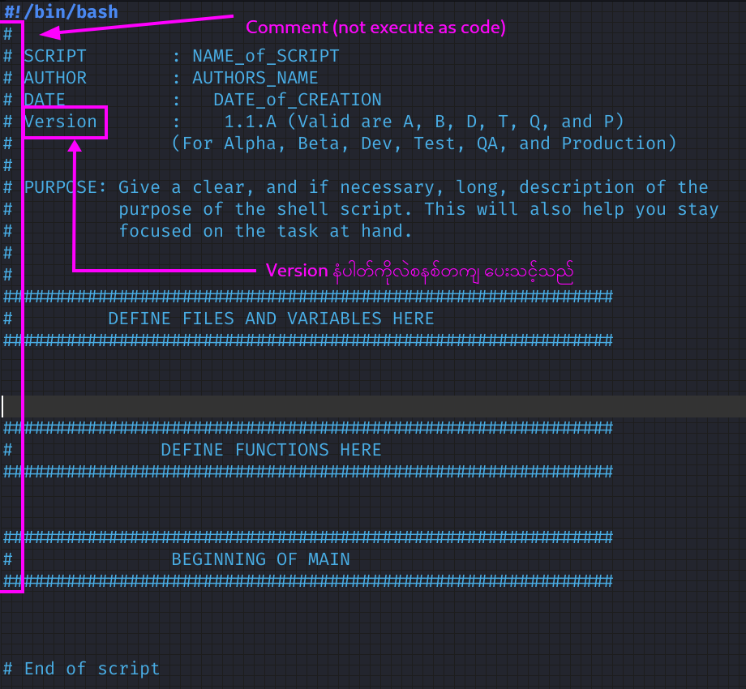

# Concept of well-written script

- Wirte code that is `readable` and has an easy flow

- write pleanty of comments describing the steps and `what our philosophy` is, `how we are using input, output, variable and files`

- use hash mark, `#`, precedes each line of a comment



# Introduction to Version Numbering

- Versioning is the process of adding unique identifiers to different versions of your package

## Semantic Versioning (`semver`)

version numbers are composed of three parts : `major`,`minor`,`patch`

#### Format of semantic versioning 

`MAJOR.MINOR.PATCH`, `1.0.1`

- `Major` version increment (e.g., from 1.2.3 to 2.0.0) when there are incompatible changes that may break backward compatibility with previous versions.
- `Minor` version increment (e.g., from 1.2.3 to 1.3.0) is made when new functionality is added 
- `Patch` version increment (e.g., from 1.2.3 to 1.2.4) is made when bugs or issues are fixed 


# Concept for template

1. Request input from user (`filename`, `purpose`) and assign variable, date can be use from output of `date` command

2. Making file in desire directory (`/home/dr404/bash_program/raw_scirpt`)

3. Echo text >> desire directory/filename

4. open file using text editor that you like 


# Template code


## Raw code 

```bash
#!/bin/bash

echo -e "Please provide filename you want to create : "
read -r file
echo -e "Please provide purpose : "
read -r purpose


touch /home/dr404/bash_program/raw_script/$file.sh

echo '#!/bin/bash' > /home/dr404/bash_program/raw_script/$file.sh
echo -e '# Script\t\t:' "$file.sh" >> /home/dr404/bash_program/raw_script/$file.sh
echo -e '# Author\t\t: Dr. 404' >> /home/dr404/bash_program/raw_script/$file.sh
echo -e '# Purpose\t\t: '"$purpose" >> /home/dr404/bash_program/raw_script/$file.sh
echo -e '# Version\t\t: ' >> /home/dr404/bash_program/raw_script/$file.sh
echo -e '# Created Date\t:' `date`  >> /home/dr404/bash_program/raw_script/$file.sh
echo -e '# Modified Date\t: \n' >> /home/dr404/bash_program/raw_script/$file.sh

subl /home/dr404/bash_program/raw_script/$file.sh
```

## Clean code

```bash
#!/bin/bash

read -p "Please provide filename you want to create: " file
read -p "Please provide purpose: " purpose

file_path="/home/dr404/bash_program/raw_script/$file.sh"

cat << EOF > "$file_path"
#!/bin/bash
# Script		: $file.sh
# Author		: Dr. 404
# Purpose		: $purpose
# Version		: 1.0.0
# Created Date	: $(date)
# Modified Date	:
#
######################################
#	Beginning of the code        #
######################################


######################################
#      End of the code               #
######################################

EOF

subl "$file_path"

```

## Explaination of new command

`EOF` - "End of File"

-  a way to pass multiple lines of input to a command or script

- When the shell encounter the EOF delimiter, it stop reading input and treat the text that came before it as the complete input  

-  Any text between the `<<` and `EOF` lines is treated as input for the cat command.


** Always rewirte your code into clear and readable format **